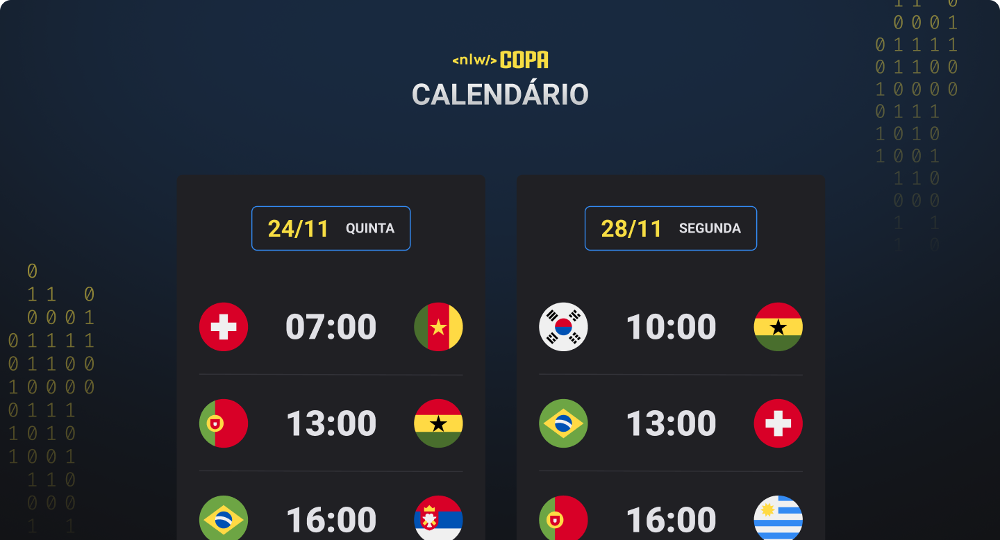

<h1 align="center"> NLW Copa - Calendário | MGN </h1>

  <a href="#-tecnologias">Tecnologias</a>&nbsp;&nbsp;&nbsp;|&nbsp;&nbsp;&nbsp;
  <a href="#-projeto">Projeto</a>&nbsp;&nbsp;&nbsp;|&nbsp;&nbsp;&nbsp;
  <a href="#-layout">Layout</a>&nbsp;&nbsp;&nbsp;|&nbsp;&nbsp;&nbsp;
  <a href="#-redes">Redes</a>

---

  

---

## 🚀 Tecnologias

Esse projeto foi desenvolvido com as seguintes tecnologias:

-  HTML
-  CSS
-  JavaScript

## 💻 Projeto

O projeto é uma maratona da Rocketseat chamada de NLW - Next Lever Week. Que dessa vez a maratona teve como tema a Copa do Mundo 2022.
O projeto teve como principal tecnologia o JavaScript, utilizando funções para que os dados de dias e jogos fossem adicionados no HTML.

## 🔖 Layout

Você pode visualizar o layout do projeto através [DESSE LINK](<https://www.figma.com/file/duueF4iu5bJCtC23uyfI83/Calend%C3%A1rio-de-Jogos-(Community)?node-id=0%3A1>).

---

## 🔗 Redes

Estas são minhas redes sociais. Sinta-se a vontade para mandar uma mensagem.

-  [Linkedin](https://www.linkedin.com/in/eomgn/)
-  [Instagram](https://www.instagram.com/matheuzngr/)
-  [Twitter](https://twitter.com/eomgn)
